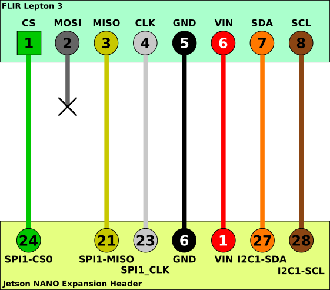
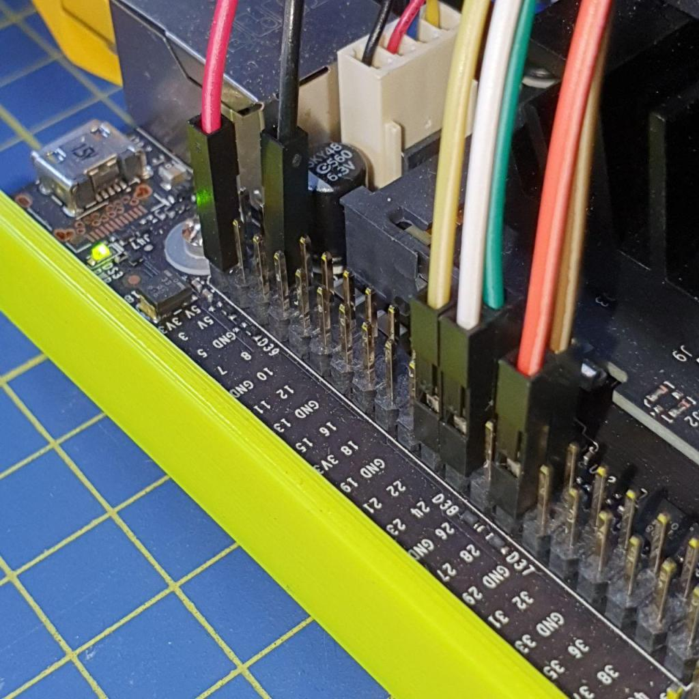
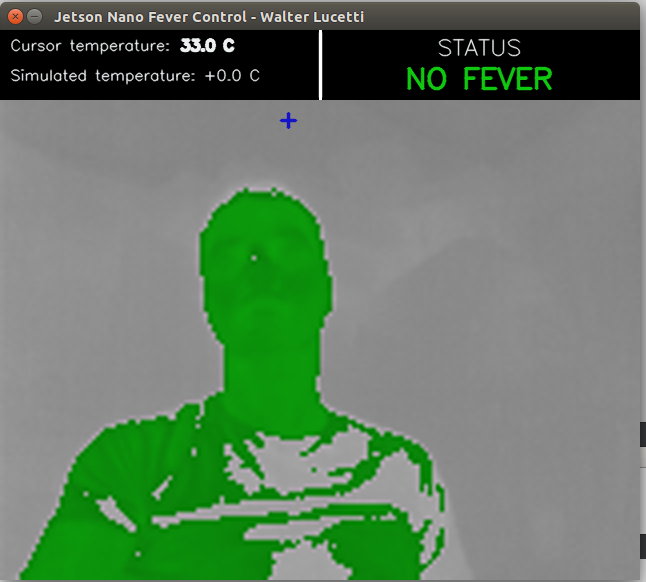
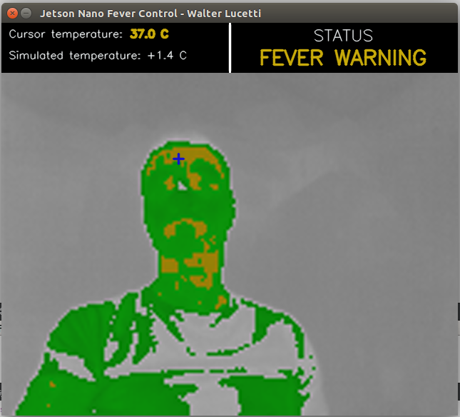
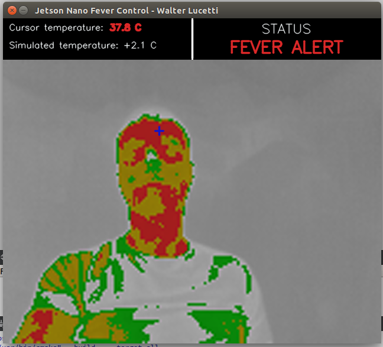

# Lepton3_Jetson

Library and examples to connect the FLIR Lepton3 thermal camera to Nvidia Jetson embedded boards


More info on Myzhar website [blog post](https://www.myzhar.com/blog/jetson-nano-with-flir-lepton3/)

## Prerequisites

* [Flir Lepton 3 module](https://www.flir.it/products/lepton/?model=500-0276-01) (can work also with Lepton 3.5)
* [Breakout Board v1.4 by Getlab](https://groupgets.com/manufacturers/getlab/products/flir-lepton-breakout-board-v1-4)
* [An Nvidia Jetson board](https://www.nvidia.com/en-us/autonomous-machines/jetson-store/) (tested on Jetson Nano with Jetpack 3.3)
* OpenCV library to compile the examples
* CMake > 2.8.9

## Software Installation

Install build requirements

`$ sudo apt install build-essential g++ libopencv-dev`

### Install latest CMake

At least CMake 3.15 is required. Check your current version:

```
cmake --version
```

Download CMake 3.18 sources:

```
version=3.18
build=1
mkdir ~/temp
cd ~/temp
wget https://cmake.org/files/v$version/cmake-$version.$build.tar.gz
tar -xzvf cmake-$version.$build.tar.gz
cd cmake-$version.$build/
```

Build and install:

```
./bootstrap
make -j$(nproc)
sudo make install
```

*Note*: in case you get an error about `OpenSSL` not found, you can install it using the command:
`sudo apt-get install libssl-dev`

Verify:
```
cmake --version
```

### Build the project

Clone this repository

`$ git clone https://github.com/Myzhar/Lepton3_Jetson.git`
   
Compile

```
$ mkdir build
$ cd build
$ cmake ..
$ make
$ cd ..
```

## Camera connection



Detailed instruction about how to connect the Lepton3 module to a Nvidia Jetson Nano are available on [Myzhar website](https://www.myzhar.com/blog/?p=4500)



### SPI buffer size change

The default buffer size use for SPI communication is set to 4096 bytes by the spidev module. Lepton3 requires 20KB of buffer to retrieve a full segment of data that composes the thermal image.

You can get the procedure to change the size of the SPI buffer for the Jetson Nano on the [Myzhar's blog](https://www.myzhar.com/blog/jetson-nano-with-flir-lepton3/#Change_SPI_buffer_size).

## Run the Demos

Two examples are provided to illustrate how to use the `lepton3_grabber` static library available in the folder `build/grabber_lib`.

### OpenCV Demo

With this sample you can see how to use OpenCV to display the thermal stream and control the camera behaviors

```
$ cd build/opencv_demo
$ ./opencv_demo
```

Keyboard commands:
* `c` -> RGB mode (24bit RGB color images)
* `r` -> Radiometry mode (16 bit gray image containing 14 bit linear thermal values )
* `h` -> High gain mode (-10°C to 140°C with 5°C of accuracy)
* `l` -> Low gain mode ( -10°C to 400°C with 10°C of accuracy)
* `a` -> Auto gain mode
* `f` -> Perform FFC normalization
* `F` -> Perform FFC radiometry normalization

### Fever control demo

With this demo you can see how to estimate temperatures from 16 bit gray images to evaluate the temperature of a person and get alarms in case of fever. 
I created this demo as a security sample application to be used in the COVID19 period.

```
$ cd build/check_fever_app
$ ./check_fever_app
```

Using keyboard `u`/`d` you can increase/decrease the estimated temperature su simulate person fever.

See the demo on [YouTube](https://youtu.be/SFStaq--3-U) 

 |  | 

    

